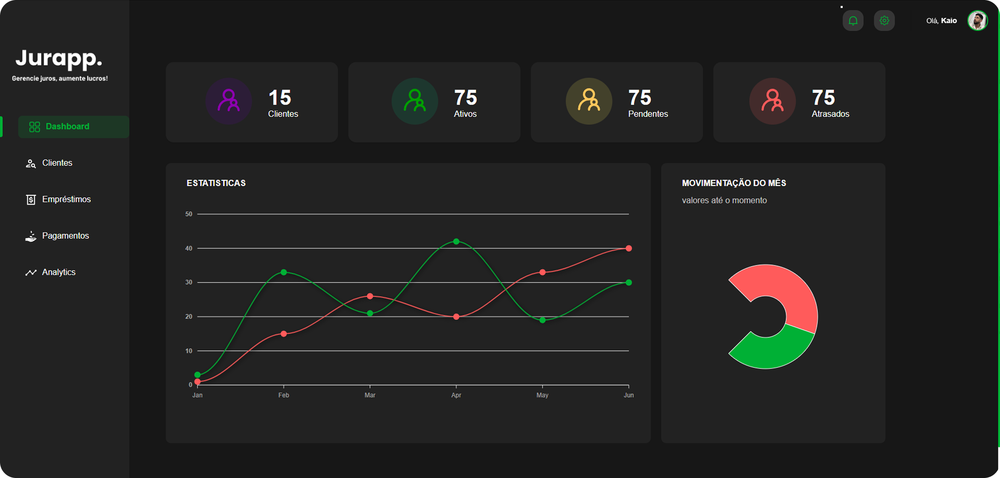

# Jurappp - Gerenciamento de Devedores





## 📑 Descrição

O **Jurappp** é uma aplicação front-end desenvolvida para auxiliar pessoas que emprestam dinheiro a ter um controle mais eficiente de seus devedores. Com uma interface intuitiva, o sistema permite o gerenciamento de clientes, empréstimos e visualização de informações financeiras de forma clara e organizada, proporcionando maior controle sobre as finanças.

---

## 🚀 Funcionalidades

- ✅ Cadastro e gerenciamento de clientes devedores
- ✅ Registro e acompanhamento de empréstimos
- ✅ Visualização de dashboards com informações financeiras (gráficos e cards)
- ✅ Páginas dedicadas para Clientes, Empréstimos e Perfil do usuário
- ✅ Interface responsiva para diferentes tamanhos de tela
- ✅ Componentes reutilizáveis para uma experiência de usuário consistente

---


## 🏗️ Arquitetura do Projeto

```
jurappp-main/
├── public/                      # Arquivos estáticos e assets públicos
├── src/                         # Código fonte da aplicação
│   ├── App.css                  # Estilos globais da aplicação
│   ├── App.jsx                  # Componente principal da aplicação
│   ├── animation.jsx            # Lógicas de animação
│   ├── assets/                  # Imagens e ícones
│   ├── components/              # Componentes reutilizáveis da UI
│   │   ├── ButtonContainer/     # Botões
│   │   ├── ContainerAdjustment/ # Ajustes de layout
│   │   ├── HeaderResize/        # Cabeçalho responsivo (Desktop e Mobile)
│   │   ├── MenuResize/          # Menu responsivo (Desktop)
│   │   └── SeachContainer/      # Componente de busca
│   ├── Context/                 # Contextos React para gerenciamento de estado
│   │   ├── FormProfileContext.jsx
│   │   └── MenuContext.jsx
│   ├── index.css                # Estilos CSS adicionais
│   ├── main.jsx                 # Ponto de entrada da aplicação
│   ├── pages/                   # Páginas principais da aplicação
│   │   ├── Clientes/            # Página de gerenciamento de clientes
│   │   ├── Construction/        # Página em construção
│   │   ├── Home/                # Dashboard principal
│   │   ├── Loans/               # Página de gerenciamento de empréstimos
│   │   └── Profile/             # Página de perfil do usuário
│   └── routes/                  # Definição de rotas da aplicação
│       └── routes.jsx
├── .eslintrc.js                 # Configuração do ESLint
├── index.html                   # Arquivo HTML principal
├── package.json                 # Metadados e dependências do projeto
├── package-lock.json            # Bloqueio de dependências
└── vite.config.js               # Configuração do Vite
```

---

## 🔧 Tecnologias Utilizadas

- React 19 (com Vite)
- JavaScript (ES6+)
- HTML5
- CSS Modules
- React Router DOM 7 (para roteamento)
- Framer Motion (para animações)
- ApexCharts e @mui/x-charts (para gráficos)
- React Icons (para ícones)

---


## 💻 Pré-requisitos

- Node.js (versão 18 ou superior)
- npm (Node Package Manager) ou Yarn

---

## 🏁 Como Executar o Projeto

### 1️⃣ Clone o Repositório

```bash
git clone https://github.com/kaiudiass/jurappp.git
cd jurappp-main
```

### 2️⃣ Instale as Dependências

```bash
npm install
# ou
yarn install
```

### 3️⃣ Inicie a Aplicação

```bash
npm run dev
# ou
yarn dev
```

A aplicação estará disponível em `http://localhost:5173` (ou outra porta, dependendo da configuração do Vite).

---


